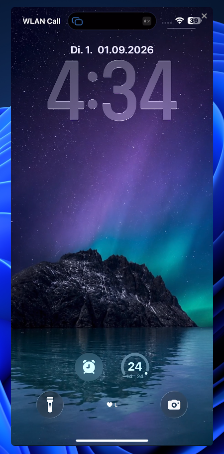

# Mirror

Windows AirPlay receiver. The iPhone stays stock. Open Control Center, tap Screen Mirroring, pick this PC.

No iPhone app. No account. Same Wi-Fi as the phone.

<p align="center">
  
</p>

Written by [ff0l](https://github.com/ff0l).

You can just use the installer. Download `Mirror-Setup-x64.exe` from [Releases](https://github.com/ff0l/phone-to-pc-mirror/releases), run the wizard, then search **Mirror** in the Start menu. No unzip.

## Use

1. Install with `Mirror-Setup-x64.exe`, or run `Mirror.exe` from a local `dist\` build.
2. Set the Windows network profile to **Private** and allow the firewall prompt.
3. On the iPhone: Control Center → **Screen Mirroring** → the name in the window (this PC’s computer name).
4. Stay on Screen Mirroring. Do not tap AirPlay inside TikTok or YouTube. That sends the clip only.

Drag the window from the picture. The X in the top-right closes it.

| Key | Action |
| --- | --- |
| F11 | Fullscreen |
| Esc | Leave fullscreen |

Phone and PC must share one LAN. Ethernet plus Wi-Fi on the same router is fine. Cellular, guest Wi-Fi, and AP isolation will not see the receiver.

Protected apps (Netflix and similar) stay black. That is Apple DRM.

## Release

[Releases](https://github.com/ff0l/phone-to-pc-mirror/releases) has `Mirror-Setup-x64.exe`. That is the normal way to get the app. After setup, Start search finds **Mirror**. Uninstall from Settings → Apps.

`.\scripts\build.ps1 package` still writes a portable `dist\` tree if you want the unzip-and-run copy.

## Tree

```
app/                    Win32 host
installer/mirror.iss    Inno Setup wizard
scripts/build.ps1       MSYS2 build, portable package, installer
third_party/uxplay      UxPlay 1.74, library mode
assets/                 icon and close-button font
docs/                   screenshots
```

## Build

Windows 10 or 11. [MSYS2](https://www.msys2.org/) at `C:\msys64`.

```powershell
.\scripts\build.ps1 bootstrap
.\scripts\build.ps1 installer
```

`bootstrap` installs the UCRT64 toolchain and GStreamer. `installer` compiles a Release build, writes `dist\`, then builds `Mirror-Setup-x64.exe`. Inno Setup 6 is installed via winget if it is missing.

```powershell
.\scripts\build.ps1 package
.\scripts\build.ps1 build
```

`package` writes the portable `dist\` tree. `build` compiles only to `build\Mirror.exe`. Run the packaged `dist\` copy, not the bare build exe.

## Notes

UxPlay is vendored at `third_party/uxplay`. AirPlay is one-way video and audio. The mouse cannot tap the phone.
